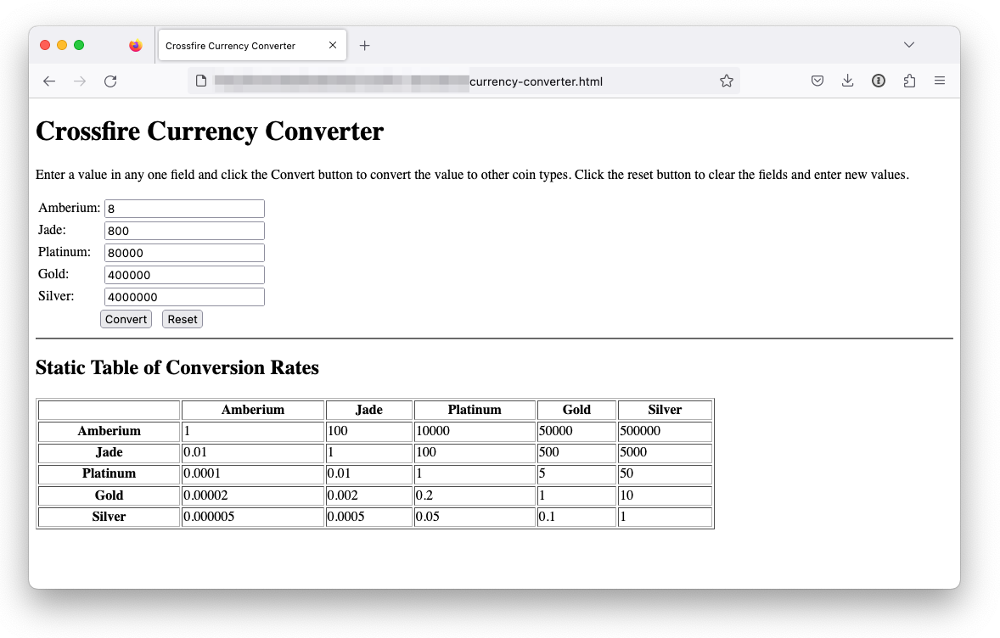
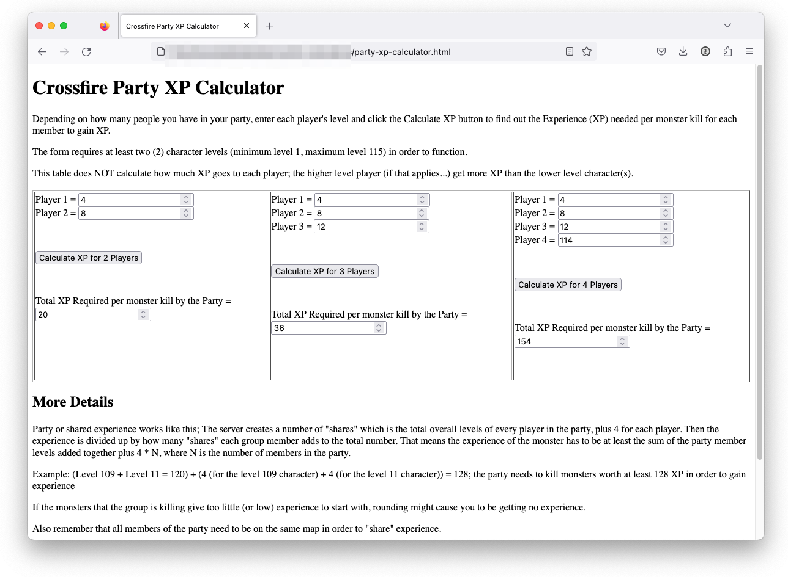

# Crossfire Calculators

This project includes various calculators for the MRPG game of Crossfire.

The calculators are HTML and javascript based pages to perform functions such as:

 * Money or currency conversions (i.e., gold to silver coins)
 * Party Experience - how much experience does a monster need to have for all members in a party to gain experience for vanquishing that foe(s)

### Requirements

A web browser with javascript enabled.

## Usage

The web pages are self contained in that the necessary html elements and javascript are all within the one web page file, so open the file in a browser and it should work.

## Screenshot

 * Sample screen shot using conversion on 8 Amberium coins
 
* Sample screen of the Party Experience Calculator with some random levels
 

## Live Web Page

 * [Currency Converter](https://crossfire.real-time.com/resources/calculators/currency-converter.html)
 * [Party XP Calculator](https://crossfire.real-time.com/resources/calculators/party-xp-calculator.html)

## Contributing

 * Contributions are welcome.
 * Pull requests are welcome.
 * Creating a fork on this code base is also welcome.

## Questions

I can be reached via [tannerrj GitHub Profile](https://github.com/tannerrj)

## License:

MIT License

## Crossfire Social Media Links

 * [Facebook](https://www.facebook.com/crossfireproject/)
 * [Mastodon](https://mastodon.social/@crossfiremrpg)
 * [X (Formerly Twitter)](https://twitter.com/crossfiremrpg/)